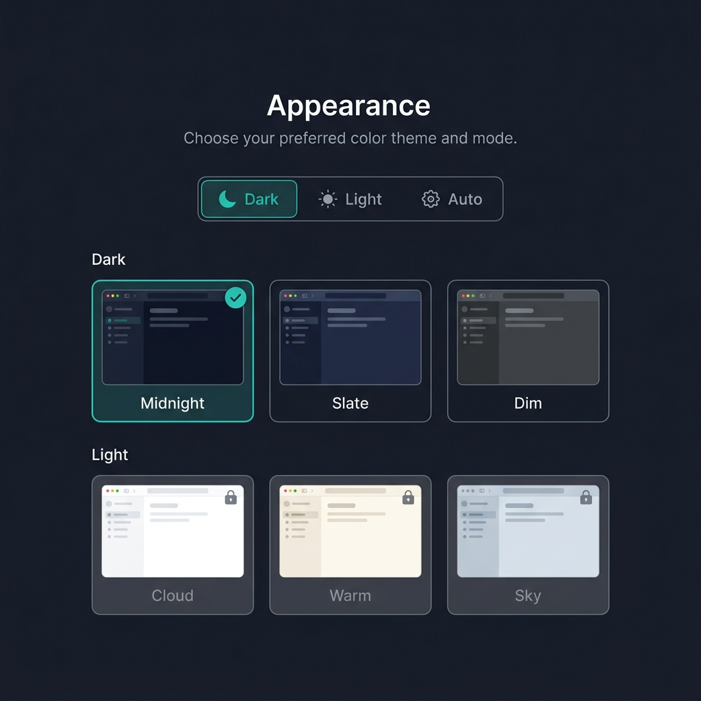
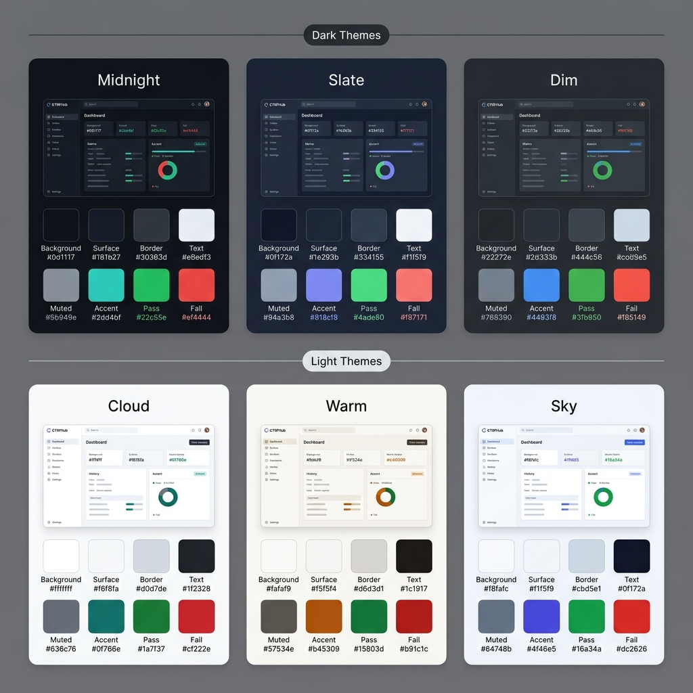

# CTRFHub — Theme Design System

## Appearance selector UI



The Appearance section lives in **Settings → Personal → Profile**. Three-segment mode control (Dark / Light / Auto) at the top. Theme variant cards below, filtered to the active mode. When **Auto** is selected, both dark and light variant rows are shown simultaneously — the browser's `prefers-color-scheme` value determines which row is active at runtime.

---

## Color palettes



---

## Dark Themes

### Midnight *(default)*
Deepest dark, teal accent. Matches the wireframe reference style.

| Token | Value | Role |
|---|---|---|
| `--color-bg` | `#0d1117` | Page background |
| `--color-surface` | `#161b27` | Cards, sidebar |
| `--color-surface-raised` | `#1f2937` | Dropdowns, tooltips |
| `--color-border` | `#30363d` | Dividers, input borders |
| `--color-text` | `#e6edf3` | Primary text |
| `--color-text-muted` | `#8b949e` | Secondary text, labels |
| `--color-accent` | `#2dd4bf` | CTA buttons, active nav, links |
| `--color-accent-fg` | `#0d1117` | Text on accent backgrounds |
| `--color-pass` | `#22c55e` | Pass status |
| `--color-fail` | `#ef4444` | Fail status |
| `--color-skip` | `#6b7280` | Skipped / pending |

**WCAG contrast (text on bg):** `#e6edf3` on `#0d1117` ≈ **16.8:1** (AAA ✓)
**WCAG contrast (muted on bg):** `#8b949e` on `#0d1117` ≈ **5.9:1** (AA ✓)
**WCAG contrast (accent on bg):** `#2dd4bf` on `#0d1117` ≈ **9.9:1** (AAA ✓)

---

### Slate
Deep navy, indigo accent. Cooler, more blue-shifted dark.

| Token | Value | Role |
|---|---|---|
| `--color-bg` | `#0f172a` | Page background |
| `--color-surface` | `#1e293b` | Cards, sidebar |
| `--color-surface-raised` | `#263548` | Dropdowns, tooltips |
| `--color-border` | `#334155` | Dividers, input borders |
| `--color-text` | `#f1f5f9` | Primary text |
| `--color-text-muted` | `#94a3b8` | Secondary text, labels |
| `--color-accent` | `#818cf8` | CTA buttons, active nav, links |
| `--color-accent-fg` | `#1e1b4b` | Text on accent backgrounds |
| `--color-pass` | `#4ade80` | Pass status |
| `--color-fail` | `#f87171` | Fail status |
| `--color-skip` | `#94a3b8` | Skipped / pending |

**WCAG contrast (text on bg):** `#f1f5f9` on `#0f172a` ≈ **17.2:1** (AAA ✓)
**WCAG contrast (muted on bg):** `#94a3b8` on `#0f172a` ≈ **7.2:1** (AAA ✓)
**WCAG contrast (accent on bg):** `#818cf8` on `#0f172a` ≈ **6.8:1** (AA ✓)

---

### Dim
Medium charcoal, blue accent. Softer dark; reduces eye strain in bright environments. Inspired by GitHub's Dimmed theme.

| Token | Value | Role |
|---|---|---|
| `--color-bg` | `#22272e` | Page background |
| `--color-surface` | `#2d333b` | Cards, sidebar |
| `--color-surface-raised` | `#373e47` | Dropdowns, tooltips |
| `--color-border` | `#444c56` | Dividers, input borders |
| `--color-text` | `#cdd9e5` | Primary text |
| `--color-text-muted` | `#768390` | Secondary text, labels |
| `--color-accent` | `#4493f8` | CTA buttons, active nav, links |
| `--color-accent-fg` | `#0d1117` | Text on accent backgrounds |
| `--color-pass` | `#3fb950` | Pass status |
| `--color-fail` | `#f85149` | Fail status |
| `--color-skip` | `#768390` | Skipped / pending |

**WCAG contrast (text on bg):** `#cdd9e5` on `#22272e` ≈ **9.7:1** (AAA ✓)
**WCAG contrast (muted on bg):** `#768390` on `#22272e` ≈ **4.5:1** (AA ✓, borderline — passes exactly)
**WCAG contrast (accent on bg):** `#4493f8` on `#22272e` ≈ **5.9:1** (AA ✓)

---

## Light Themes

### Cloud *(default light)*
Pure white, teal accent. Clean, clinical, maximum readability.

| Token | Value | Role |
|---|---|---|
| `--color-bg` | `#ffffff` | Page background |
| `--color-surface` | `#f6f8fa` | Cards, sidebar |
| `--color-surface-raised` | `#ffffff` | Dropdowns, tooltips |
| `--color-border` | `#d0d7de` | Dividers, input borders |
| `--color-text` | `#1f2328` | Primary text |
| `--color-text-muted` | `#636c76` | Secondary text, labels |
| `--color-accent` | `#0f766e` | CTA buttons, active nav, links |
| `--color-accent-fg` | `#ffffff` | Text on accent backgrounds |
| `--color-pass` | `#1a7f37` | Pass status |
| `--color-fail` | `#cf222e` | Fail status |
| `--color-skip` | `#6e7781` | Skipped / pending |

**WCAG contrast (text on bg):** `#1f2328` on `#ffffff` ≈ **17.5:1** (AAA ✓)
**WCAG contrast (muted on bg):** `#636c76` on `#ffffff` ≈ **5.9:1** (AA ✓)
**WCAG contrast (accent on bg):** `#0f766e` on `#ffffff` ≈ **5.5:1** (AA ✓)

---

### Warm
Stone/parchment tones, amber accent. Easier on the eyes for long reading sessions.

| Token | Value | Role |
|---|---|---|
| `--color-bg` | `#fafaf9` | Page background |
| `--color-surface` | `#f5f5f4` | Cards, sidebar |
| `--color-surface-raised` | `#ffffff` | Dropdowns, tooltips |
| `--color-border` | `#d6d3d1` | Dividers, input borders |
| `--color-text` | `#1c1917` | Primary text |
| `--color-text-muted` | `#57534e` | Secondary text, labels |
| `--color-accent` | `#b45309` | CTA buttons, active nav, links |
| `--color-accent-fg` | `#ffffff` | Text on accent backgrounds |
| `--color-pass` | `#15803d` | Pass status |
| `--color-fail` | `#b91c1c` | Fail status |
| `--color-skip` | `#78716c` | Skipped / pending |

**WCAG contrast (text on bg):** `#1c1917` on `#fafaf9` ≈ **17.2:1** (AAA ✓)
**WCAG contrast (muted on bg):** `#57534e` on `#fafaf9` ≈ **7.4:1** (AAA ✓)
**WCAG contrast (accent on bg):** `#b45309` on `#fafaf9` ≈ **4.8:1** (AA ✓)

---

### Sky
Cool blue-gray, indigo accent. Developer-friendly; similar to VS Code light.

| Token | Value | Role |
|---|---|---|
| `--color-bg` | `#f8fafc` | Page background |
| `--color-surface` | `#f1f5f9` | Cards, sidebar |
| `--color-surface-raised` | `#ffffff` | Dropdowns, tooltips |
| `--color-border` | `#cbd5e1` | Dividers, input borders |
| `--color-text` | `#0f172a` | Primary text |
| `--color-text-muted` | `#64748b` | Secondary text, labels |
| `--color-accent` | `#4f46e5` | CTA buttons, active nav, links |
| `--color-accent-fg` | `#ffffff` | Text on accent backgrounds |
| `--color-pass` | `#16a34a` | Pass status |
| `--color-fail` | `#dc2626` | Fail status |
| `--color-skip` | `#6b7280` | Skipped / pending |

**WCAG contrast (text on bg):** `#0f172a` on `#f8fafc` ≈ **18.1:1** (AAA ✓)
**WCAG contrast (muted on bg):** `#64748b` on `#f8fafc` ≈ **5.5:1** (AA ✓)
**WCAG contrast (accent on bg):** `#4f46e5` on `#f8fafc` ≈ **6.1:1** (AA ✓)

---

## Implementation

### CSS custom properties

All tokens map to CSS custom properties on the `<html>` element via `data-theme`:

```css
/* Midnight (default) */
[data-theme="midnight"] {
  --color-bg:             #0d1117;
  --color-surface:        #161b27;
  --color-surface-raised: #1f2937;
  --color-border:         #30363d;
  --color-text:           #e6edf3;
  --color-text-muted:     #8b949e;
  --color-accent:         #2dd4bf;
  --color-accent-fg:      #0d1117;
  --color-pass:           #22c55e;
  --color-fail:           #ef4444;
  --color-skip:           #6b7280;
}

/* Example: Dim */
[data-theme="dim"] {
  --color-bg:             #22272e;
  /* ...etc */
}
```

No component uses hardcoded hex values. Every colour reference is `var(--color-*)`.

### Theme storage

Stored in `user_profiles.settings JSONB` (per DD-009):
```json
{ "mode": "dark", "theme": "midnight" }
```

`mode` is `"dark"` | `"light"` | `"auto"`. `theme` is the variant name within the active mode.

### Auto mode — browser detection

```typescript
// On page load
const { mode, theme } = userSettings.appearance;

if (mode === 'auto') {
  const prefersDark = window.matchMedia('(prefers-color-scheme: dark)').matches;
  document.documentElement.dataset.theme = prefersDark
    ? userSettings.darkTheme   // e.g. 'midnight'
    : userSettings.lightTheme; // e.g. 'cloud'

  // Live listener for OS-level switches
  window.matchMedia('(prefers-color-scheme: dark)')
    .addEventListener('change', e => {
      document.documentElement.dataset.theme = e.matches
        ? userSettings.darkTheme
        : userSettings.lightTheme;
    });
} else {
  document.documentElement.dataset.theme = theme;
}
```

When `Auto` is selected, the user can independently choose their preferred dark variant AND their preferred light variant — the OS toggle switches between them seamlessly.

### Storage shape (extended for Auto)

```json
{
  "mode": "auto",
  "dark_theme": "midnight",
  "light_theme": "cloud"
}
```

### Selector UX behaviour

- **Dark selected** → only dark variant cards are clickable; light cards are shown dimmed (opacity 40%) with a lock icon
- **Light selected** → inverse — light cards active, dark dimmed
- **Auto selected** → both rows fully active; a "When dark" and "When light" label above each row; user can pick one variant per row
- Theme change applies immediately with a 150ms CSS transition on `background-color` and `color` — no page reload

---

## Shared tokens (all themes)

These do not change between themes — they are global:

| Token | Value | Role |
|---|---|---|
| `--font-sans` | `'Inter', system-ui, sans-serif` | All UI text |
| `--font-mono` | `'JetBrains Mono', 'Fira Code', monospace` | Code, stack traces, IDs |
| `--radius-sm` | `4px` | Inputs, small elements |
| `--radius-md` | `8px` | Cards, modals |
| `--radius-lg` | `12px` | Large panels |
| `--shadow-sm` | `0 1px 3px rgba(0,0,0,0.3)` | Subtle card lift |
| `--shadow-md` | `0 4px 16px rgba(0,0,0,0.4)` | Modals, dropdowns |
| `--transition-fast` | `150ms ease` | Theme switch, hover states |
